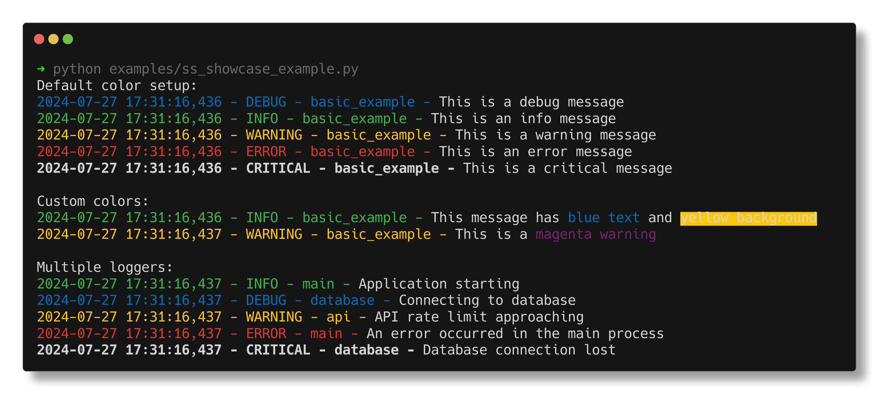
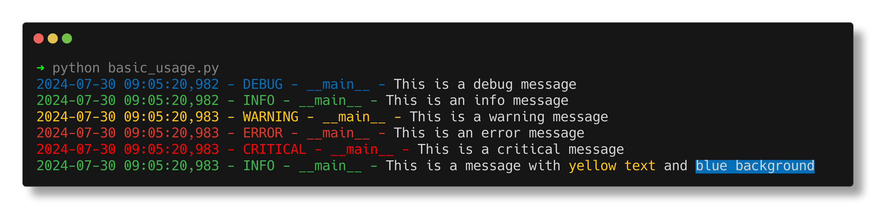
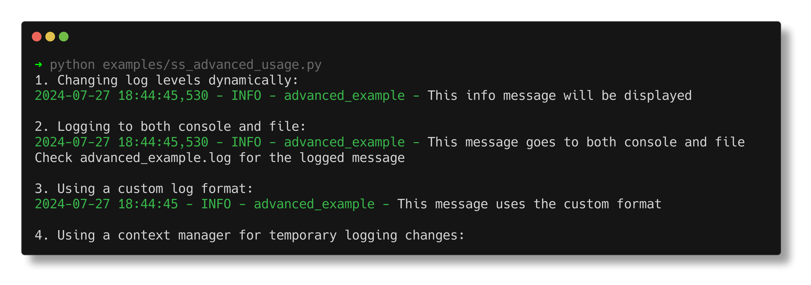

# 🌈 Colored Custom Logger

[](https://badge.fury.io/py/colored-custom-logger)
[](https://opensource.org/licenses/MIT)
[](https://pypi.org/project/colored-custom-logger/)

Turn your monochrome console into a vibrant logging fiesta! 🎉

## 🌟 Features

- 🎨 Colorful date and log level outputs
- 🚦 Easy-to-distinguish log levels
- 🔧 Customizable and extendable
- 🚀 Simple to integrate into existing projects
- 🐍 Pure Python, no extra dependencies (except colorama for Windows support)

## 📸 See It in Action

Feast your eyes on these beautiful logs:



*Note: Replace this with an actual screenshot of your logger in action*

## 🚀 Installation

Get started with a simple pip install:

```bash
pip install colored-custom-logger
```

## 🎮 Quick Start

Here's a taste of what you can do with Colored Custom Logger:

```python
from colored_custom_logger import CustomLogger

# Create your fabulous logger
logger = CustomLogger.get_logger(__name__)

# Let the colorful logging begin!
logger.debug("🔍 This is a debug message")
logger.info("ℹ️ Here's some info for you")
logger.warning("⚠️ Uh-oh, this is a warning")
logger.error("❌ Oops! We've got an error")
logger.critical("🚨 MAYDAY! MAYDAY! This is critical!")
```

And voilà! Your console will transform into this:



*Note: Replace this with an actual screenshot of your logger output*

## 🌈 Color Scheme

Our carefully curated color palette ensures your logs are both beautiful and readable:

- 🔵 DEBUG: Cool Blue
- 🟢 INFO: Go Green
- 🟡 WARNING: Yummy Yellow
- 🔴 ERROR: Radical Red
- 🔥 CRITICAL: Blazing Bright Red

## 🛠️ Advanced Usage

Want to customize your logger further? No problem! Check out our advanced usage guide:



*Note: Replace this with an image showcasing advanced usage examples*

## 🤝 Contributing

We love contributions! If you have ideas for new features, improvements, or just want to report a bug, please open an issue or submit a pull request. Let's make logging colorful for everyone! 🌈

## 📜 License

This project is licensed under the MIT License - see the [LICENSE](LICENSE) file for details.

## 🙏 Acknowledgements

- Thanks to the [colorama](https://pypi.org/project/colorama/) project for making cross-platform colored terminal text output possible.
- Inspired by all the monochrome loggers out there, waiting for a splash of color.

---

Made with ❤️ and 🌈 by [Robin Collins](https://github.com/robin-collins)

Remember, life's too short for boring logs! 🎭🎨