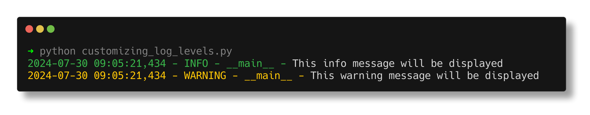
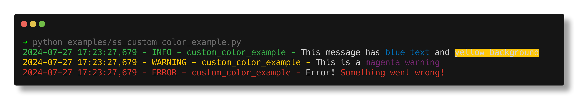
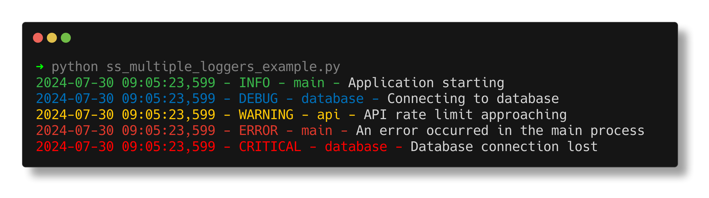
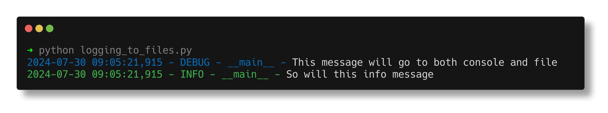
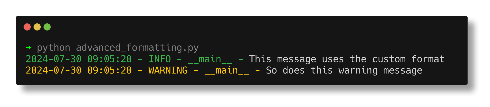
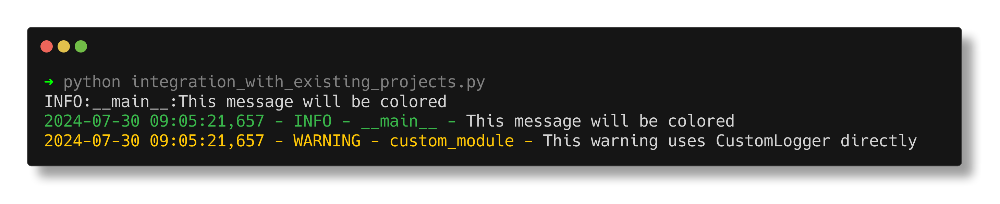

# Usage Guide

This guide provides comprehensive examples of how to use the `colored_custom_logger` module in your Python projects. From basic setup to advanced features, you'll find everything you need to make the most of colored logging in your applications.

## Table of Contents

- [Usage Guide](#usage-guide)
  - [Table of Contents](#table-of-contents)
  - [Basic Usage](#basic-usage)
  - [Customizing Log Levels](#customizing-log-levels)
  - [Using Custom Colors](#using-custom-colors)
  - [Multiple Loggers](#multiple-loggers)
  - [Logging to Files](#logging-to-files)
  - [Advanced Formatting](#advanced-formatting)
  - [Integration with Existing Projects](#integration-with-existing-projects)

## Basic Usage

To get started with `colored_custom_logger`, follow these simple steps:

1. Import the `CustomLogger` class:

```python
from colored_custom_logger import CustomLogger
```

2. Create a logger instance:

```python
logger = CustomLogger.get_logger(__name__)
```

3. Start logging messages:

```python
logger.debug("This is a debug message")
logger.info("This is an info message")
logger.warning("This is a warning message")
logger.error("This is an error message")
logger.critical("This is a critical message")
```

Here's how the output might look:

[Link to github example](https://github.com/robin-collins/colored_custom_logger/blob/main/examples/basic_usage.py)

## Customizing Log Levels

You can customize the log level to control which messages are displayed:

```python
import logging
from colored_custom_logger import CustomLogger

logger = CustomLogger.get_logger(__name__, level=logging.INFO)

logger.debug("This debug message won't be displayed")
logger.info("This info message will be displayed")
logger.warning("This warning message will be displayed")
```

You can also change the log level dynamically:

```python
logger.setLevel(logging.DEBUG)
logger.debug("Now this debug message will be displayed")
```


[Link to github example](https://github.com/robin-collins/colored_custom_logger/blob/main/examples/customizing_log_levels.py)

## Using Custom Colors

You can incorporate custom colors into your log messages using the `colorama` library:

```python
from colored_custom_logger import CustomLogger
from colorama import Fore, Back, Style

logger = CustomLogger.get_logger(__name__)

logger.info(f"This message has {Fore.BLUE}blue text{Style.RESET_ALL}")
logger.warning(f"This is a {Fore.MAGENTA}magenta warning{Style.RESET_ALL}")
logger.error(f"Error! {Back.WHITE}{Fore.RED}Something went wrong!{Style.RESET_ALL}")
```

[Link to github example](https://github.com/robin-collins/colored_custom_logger/blob/main/examples/ss_custom_color_example.py)

## Multiple Loggers

For larger applications, you might want to use multiple loggers:

```python
main_logger = CustomLogger.get_logger("main")
db_logger = CustomLogger.get_logger("database")
api_logger = CustomLogger.get_logger("api")

main_logger.info("Application starting")
db_logger.debug("Connecting to database")
api_logger.warning("API rate limit approaching")
```

[Link to github example](https://github.com/robin-collins/colored_custom_logger/blob/main/examples/ss_multiple_loggers_example.py)

## Logging to Files

You can configure your logger to write to a file in addition to the console:

```python
import logging
from colored_custom_logger import CustomLogger

logger = CustomLogger.get_logger(__name__)

# Create a file handler
file_handler = logging.FileHandler("app.log")
file_handler.setLevel(logging.DEBUG)

# Create a formatting for the file logs
file_formatter = logging.Formatter('%(asctime)s - %(name)s - %(levelname)s - %(message)s')
file_handler.setFormatter(file_formatter)

# Add the file handler to the logger
logger.addHandler(file_handler)

logger.debug("This message will go to both console and file")
logger.info("So will this info message")
```

[Link to github example](https://github.com/robin-collins/colored_custom_logger/blob/main/examples/logging_to_files.py)

## Advanced Formatting

You can create custom formats for your log messages:

```python
from colored_custom_logger import CustomLogger, ColoredFormatter
import logging

logger = CustomLogger.get_logger(__name__)

custom_formatter = ColoredFormatter(
    fmt="%(asctime)s | %(levelname)8s | %(name)s | %(message)s",
    datefmt="%Y-%m-%d %H:%M:%S"
)

# Assuming the first handler is the console handler
console_handler = logger.handlers[0]
console_handler.setFormatter(custom_formatter)

logger.info("This message uses the custom format")
logger.warning("So does this warning message")
```

[Link to github example](https://github.com/robin-collins/colored_custom_logger/blob/main/examples/advanced_formatting.py)

## Integration with Existing Projects

If you're integrating `colored_custom_logger` into an existing project, you might need to configure it to work with other logging setups:

```python
import logging
from colored_custom_logger import CustomLogger, ColoredFormatter

# Configure the root logger
logging.basicConfig(level=logging.INFO)

# Create a colored formatter
colored_formatter = ColoredFormatter()

# Get the root logger and add a colored console handler
root_logger = logging.getLogger()
console_handler = logging.StreamHandler()
console_handler.setFormatter(colored_formatter)
root_logger.addHandler(console_handler)

# Now you can create loggers as usual, and they'll use the colored formatter
logger = logging.getLogger(__name__)
logger.info("This message will be colored")

# You can still create CustomLogger instances for specific modules
custom_logger = CustomLogger.get_logger("custom_module")
custom_logger.warning("This warning uses CustomLogger directly")
```

[Link to github example](https://github.com/robin-collins/colored_custom_logger/blob/main/examples/integration_with_existing_projects.py)

By following these examples, you should be able to make full use of the `colored_custom_logger` in your Python projects. Remember to adjust the log levels and formats to best suit your specific needs.

For more detailed information about the `CustomLogger` and `ColoredFormatter` classes, check out the [API Reference](api.md).